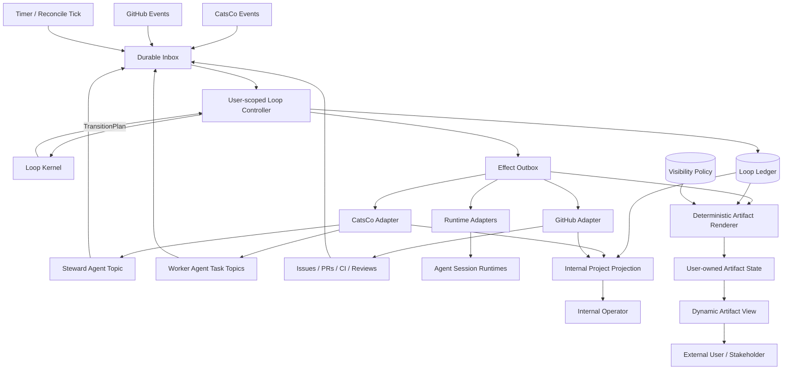
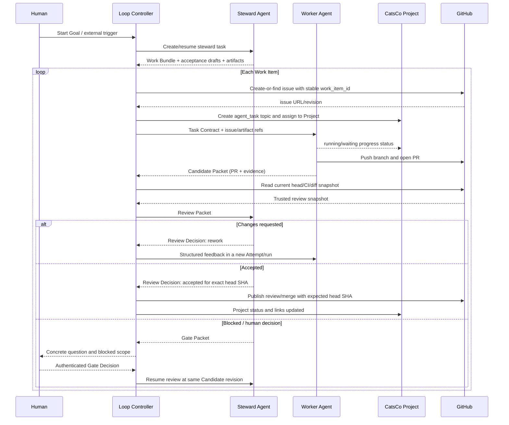
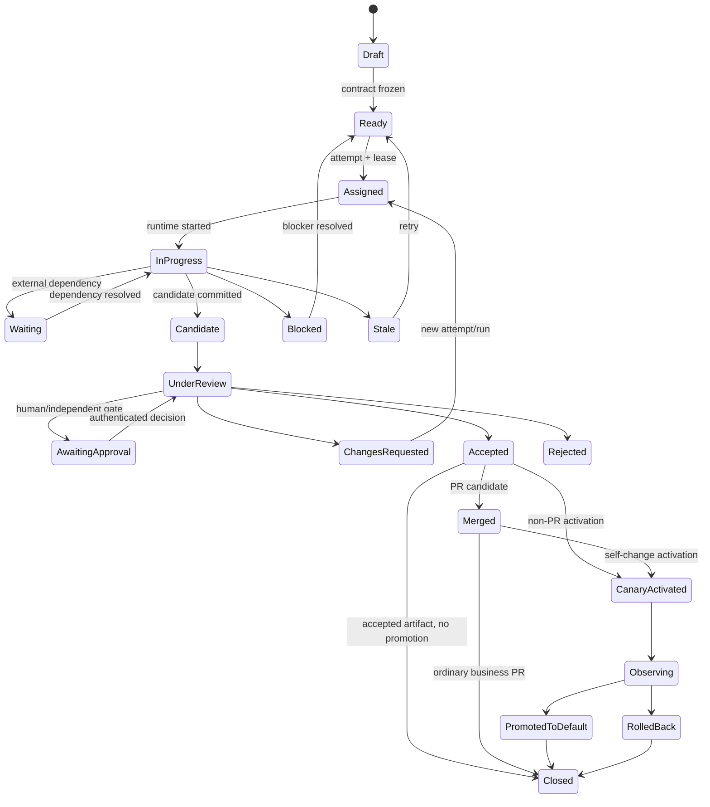
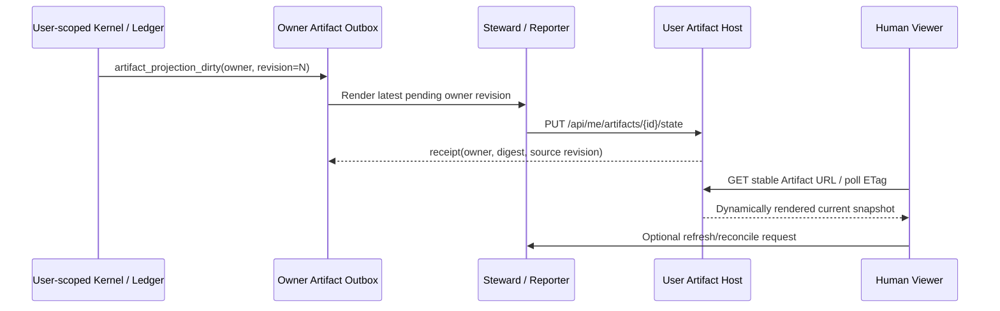
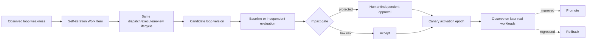

# Loop System Architecture

## 1. 设计结论

原始判断“业务任务和自迭代本质都是同一个 Loop”是正确的，但需要收窄：

> 两者共享同一个状态转换内核；差异由版本化 Loop Profile 表达，而不只是 context 和 reference path。

必须补充的差异包括：

- 谁能提议、验收和激活变更；
- 哪些路径和操作可写；
- 是否必须独立评审或人工审批；
- 合并后是否立即激活；
- 如何灰度、观察和回滚；
- 最大预算、并发和元递归深度。

## 2. 现有 CatsCo 基础

当前 CatsCo 已具备可复用的基础：

1. owner 与 Agent 的私有 P2P topic 提供默认执行通道；standard group 仅在多个 Human 需要监督 Review 时显式使用。`agent_task` group 不属于当前 P0 Worker dispatch 路径，也不能作为可靠授权边界；
2. Project 将多个 conversation topics 归组，但以 `owner_uid` 隔离且不复制消息；
3. `ConversationTaskStatus` 提供 `run_id/state/summary/error/source_uid/expiry`；
4. Bot SDK 能发布 task status、上传文件和发送文件消息；
5. Web UI 已在 Project 下展示任务与状态摘要；
6. GitHub 继续提供 issue、commit、PR、CI、review 和 merge 事实。

这意味着不需要从零建设看板，也不能把 conversation 当作唯一控制状态。

## 3. 原方案的不足

### 3.1 `context + reference_path` 参数不足

`reference_path` 混淆了“可读参考”和“可写目标”。统一 Loop 至少要区分：

- `reference_snapshot`：固定版本的只读依据；
- `write_scope`：本任务允许修改的范围；
- `acceptance_policy`：谁按什么标准验收；
- `promotion_policy`：验收后何时、如何激活；
- `impact_class`：变更影响等级。

### 3.2 Steward 与 Controller 不能混为一个 Agent

Steward Agent 做语义判断；Controller 做可靠转接。若全部交给一个 LLM session：

- session 结束后租约和重试状态丢失；
- 同一消息可能重复创建 issue 或 task；
- solver 完成事件可能遗漏；
- Agent 容易把“候选完成”误判为“最终验收”。

因此需要 Controller，但它是确定性模块，不是第三个 LLM Agent。

### 3.3 人类视图不能从聊天记录临时推断

人类真正需要的是：

- 哪些任务在执行；
- 谁在执行；
- 最近验证了什么；
- 哪些任务待审或被阻塞；
- 用户不操作时下一步是什么。

这些应由结构化状态生成 Projection，而不是要求人翻阅多个 topics。现有 CatsCo Project 只能承担 Steward User 私有的 Internal Operator View；MVP 由该 User Workspace 维护脱敏 Dynamic Project Artifact。

### 3.4 `completed` 不是 `accepted`

当前 CatsCo task status 的 `completed` 适合表示 Attempt 已提交结果，但不足以表示：

- Candidate 已提交；
- PR 正在审查；
- 已验收；
- 已合并；
- 已激活；
- 已观察到真实收益。

Work Item 生命周期必须与 runtime task status 分离。

### 3.5 自迭代存在自我授权风险

自迭代若可以修改并立即使用自己的验收器、权限、路由或提示词，会出现：

- 降低验收标准后自称提升；
- 用候选 evaluator 评判自身；
- 在途任务前后使用不同规则；
- 合并后真实表现下降但已经全量激活。

因此 protected self-iteration 需要基线版本评审、独立审批、activation epoch、canary 和 rollback。

### 3.6 当前 OpenCLI watch 只能作为唤醒提示

现有 watch 使用本地 cursor，并可能在 hook/command 失败后继续推进。它不能单独充当持久 scheduler 或事件账本。

Controller 必须采用：

- durable inbox；
- 至少一次处理；
- 幂等 transition；
- 处理成功后 ACK；
- 周期性 CatsCo/GitHub reconciliation。

### 3.7 Conversation、Session、Attempt 与完成不能混同

Conversation/topic 是持久通信容器；Runtime Session 是短命连接与执行实例；Attempt 是带 generation/lease 的工作尝试；Work Item 才承载语义生命周期。

系统不需要在正确性路径上判断断线究竟来自网络还是进程崩溃。它只判断：

- Candidate Submission 是否已经 durable commit；
- 当前 Attempt 是否仍有有效 lease/generation；
- 是否需要 recovery reconciliation。

`offline/ping_timeout/socket_closed` 只更新 `connection=disconnected` 并触发 reconciliation；只有 body lease/liveness 阈值失效才把 `control_state` 推入 `suspect`。两者都不会直接完成、失败或解锁下游任务。约两分钟的 body lease 是 failure-detector input；六小时 task-status TTL 是展示/陈旧上限，都不是完成证明。

### 3.8 Steward User 是控制与资源边界

Loop 不属于 CatsCo system-global namespace，而属于一个 Steward User Workspace：

- Project 的 owner 是 Steward `owner_uid`；
- Loop 是 Human 显式 opt-in；Review 先验证 owner 的 OpenCLI 登录和可用 Worker；
- Worker 来自该用户的 friend graph；没有合格 Worker 时，Review 请求作者提供 Agent UID，并通过 `friend-request` 建立 addressability 后重新发现；
- Ledger/inbox/outbox/actions 都以 `owner_uid` 分区；
- Controller 使用该用户委托的 capability，不持有全站用户凭据；
- Artifact 由该用户创建、更新和分享；
- 人类通过与 Steward User 的 session 获得 viewer access。

底层实现可以共享进程、数据库和 Artifact Host，但共享的是 infrastructure，不是 authority。

## 4. 总体架构



### 4.1 Loop Kernel

Kernel 是深模块，外部 interface 保持很小：

```text
decide(snapshot, event) -> TransitionPlan
```

它负责：

- 状态机和合法转换；
- Attempt 租约与 fencing；
- Gate、Acceptance 和 Promotion 规则；
- Loop Profile 策略；
- 幂等键和 expected revision；
- 下一步 effect 计划。

它不直接发送消息、创建 issue 或调用 Agent。

### 4.2 Loop Controller

Controller：

1. 从 durable inbox 读取事件；
2. 加载 Ledger snapshot；
3. 调用 Kernel；
4. 原子提交状态和 outbox effects；
5. 执行 effects 并记录 receipts；
6. 对 CatsCo 和 GitHub 进行周期性 reconciliation。

Controller 可以作为常驻轻量进程、serverless handler 或短命 CLI tick 运行。可靠性来自 user-scoped Ledger/inbox/outbox，不来自进程永远存活。一个物理 Controller 可以多租户运行，但每个 tick 只能在单一 `owner_uid` namespace 内加载状态和 credential。

Steward 在产品层就是一个类似人类的 CatsCo user：它可以被人类加入 session、拥有 Project/Artifacts、添加 Worker Users 为好友，并提出 `dispatch/review/report` intents。Friendship 只提供 addressability。实际 OpenCLI effect 由该用户委托的 Controller capability 执行并 readback；不得把 owner token 暴露给 LLM shell，也不得存在跨所有用户的 system owner token。

### 4.3 CatsCo Adapter

职责：

- 创建独立 `agent_task` topic；
- 将 topic 归入 CatsCo Project；
- 发送 Task Contract 和附件；
- 读取消息与 task status；
- 让拥有 topic membership 的 Worker runtime 以自身身份写入 Attempt 级 task status；
- 将 Candidate/Review Decision 在 topics 间可靠投递；
- 检测 `agent_task` 成员漂移，但不把 topic membership 当成租约或授权证明。

不负责：

- 决定任务是否通过验收；
- 推断 GitHub PR 是否可接受；
- 保存完整 Loop lifecycle。

MVP 前置的 CatsCo 协议补强：

- task group create 接受 owner-scoped `external_work_item_id` 并建立唯一约束；
- message send 暴露稳定 `client_message_id`，服务端重复请求返回原 receipt；
- Runtime Adapter 通过受认证的回调或签名 receipt 证明 `body_id/session_id/lease_generation`；
- create/send effect 必须存在可查询 postcondition，Controller 崩溃后能够判定“已执行”而不是盲目重试。

在这些能力落地前，只允许单实例、单纵向链路试验；不能声称 crash-safe 自动分配。

### 4.4 GitHub Adapter

职责：

- 根据 Steward 的 issue proposal 执行 create-or-find issue；
- 读取 issue/PR/CI/review/merge 状态；
- 维护稳定的 Work Item 标记和链接；
- 把 PR/CI evidence 绑定到 commit SHA；
- 执行已授权的 comment/review/merge effect。

GitHub 是代码交付事实来源，不是 Agent runtime 的租约账本。

### 4.5 Runtime Adapter

不同 CatsCo Agent 可以连接不同 session runtime。每个 adapter 对 Controller 暴露统一能力：

```text
start(task_contract) -> session_receipt
resume(attempt_id, feedback) -> session_receipt
cancel(attempt_id) -> receipt
observe(attempt_id) -> runtime_observation
```

Runtime Adapter 必须返回稳定的 session/body identity，不能只依赖 Agent UID。

### 4.6 User-owned Dynamic Artifact

Artifact 的所有权边界是 Steward CatsCo User，而不是 Loop System。每个 Artifact 绑定 `owner_uid + external_key`；Steward User 可以在任意人类 session 中创建自己的 Artifact，并授予该 topic viewer 权限。共享物理服务可以承载多个用户，但所有读写都从 authenticated principal 推导 owner namespace，客户端不能指定任意 owner UID。

```text
Steward User Workspace
  ├─ Friends / Worker Agents
  ├─ Projects
  ├─ user-scoped Loop Ledger + Controller delegation
  └─ User-owned Artifacts
       └─ project-status artifact
```

Controller 在该用户的物质状态转换 transaction 中追加 `artifact_projection_dirty(owner_uid, external_key, source_ledger_revision)`。Reporter 生成脱敏 canonical snapshot。交互式刷新可由 Steward User 通过自身认证的 OpenCLI 直接更新；自动 material-transition 更新使用该 User 授予 Controller 的 artifact-scoped delegation：

```text
User-scoped Ledger transition
          ↓
artifact_projection_dirty(owner_uid, revision=N)
          ↓
deterministic snapshot + Visibility Policy
          ↓
/api/me/artifacts/{id}/state (monotonic source_revision)
          ↓
stable user-owned Artifact URL dynamically renders current state
```

#### 4.6.1 物理共享不等于 system scope

最小实现不为每个用户启动独立服务器。CatsCo 可以提供一个共享的 multi-tenant Artifact Host，但它只提供通用 user capability：identity、state storage、viewer ACL、stable URL 和 renderer。它不知道 Work Item、Candidate、Review 或 Loop transitions。

每个 resource row 和 cache key 都必须包含 `owner_uid`。Controller 也按 `owner_uid` 分区；不存在一个持有所有用户 owner credentials 的全局 publisher。

#### 4.6.2 最小 user-scoped API

```text
POST /api/me/artifacts
  body: external_key + renderer_ref + viewer_topic_id
  → create-or-find Artifact owned by authenticated user

PUT /api/me/artifacts/{artifact_id}/state
  body: source_ledger_revision + canonical snapshot + digest
  → update only when source revision advances

POST /api/me/artifacts/{artifact_id}/viewer-grants
DELETE /api/me/artifacts/{artifact_id}/viewer-grants/{topic_id}
  → owner-authenticated share/revoke for CatsCo topics

GET /api/me/artifacts/{artifact_id}
  → owner metadata

GET /artifacts/{public_id}
  → authenticated viewer HTML shell

GET /api/artifacts/{public_id}/snapshot
  → viewer-scoped current snapshot + ETag
```

MVP 不需要通用静态 publish/version service。`source_ledger_revision` 就是单调版本：相同 revision + 相同 digest 幂等成功；相同 revision + 不同 digest 冲突；较旧 revision 拒绝；较新 revision 原子替换当前 snapshot。Loop Ledger 已保存历史，因此 Artifact Host 第一版只保存当前 Projection。

#### 4.6.3 打开中的页面热更新

稳定 HTML shell 每 5–10 秒使用 `If-None-Match` 获取 snapshot。无变化返回 `304`；有新 revision 返回新 JSON 并重绘。后续可以替换为 SSE，但不改变 user ownership 或 Kernel protocol。

Artifact Host 只渲染确定性字段；LLM 只能产生明确标注且经过转义的 narrative。当前 `project-sessions` 缺失字段必须标记 unavailable，不从自由文本猜测。

权限拆分为：

- Steward User：Artifact owner，可直接创建/更新/分享自己的 Artifact；
- Reporter capability：读取该 owner 的 Project/Ledger projection；
- Controller delegation：只为自动更新该 owner namespace 中指定 Artifact；
- Human viewer：通过 Artifact share/topic membership 只读；
- Worker User：默认无权更新 Steward User 的 Artifact。

禁止进入 Artifact：内部 topic/session/body identity、Agent prompt、原始对话/reasoning、本地路径、凭据、内部错误栈、未授权 artifact 和内部评审备注。

Dynamic Artifact 是 user-owned Projection：更新失败只保留该用户的 projection dirty effect；它不能作为 Candidate evidence、Reference Snapshot 的可变引用，或下一轮 Loop 的触发信号。需要审计/导出时再从指定 `source_ledger_revision + content_digest` 生成 immutable snapshot。

## 5. 任务分配与验收流程



### 5.1 Steward Agent 的职责

Steward 必须在分配前产出：

- Work Item 目标与非目标；
- 依赖关系；
- Acceptance Contract；
- 推荐 Worker/capabilities；
- Reference Snapshot；
- Write Scope；
- GitHub issue 内容；
- Artifact manifest。

Steward 起草 issue 的语义内容；Controller/GitHub Adapter 负责 create-or-find、幂等和 receipt。

### 5.2 Worker 的职责

Worker：

- 接受一个带 revision 的 Task Contract；
- 在隔离工作区/分支执行；
- 发布 Attempt 状态；
- 提交 Candidate Packet；
- 根据 Review Decision 修复或停止。

Worker 不得修改验收标准后继续沿用旧 Attempt，也不能自行 accepted/merged。

### 5.3 验收

验收至少绑定：

- Work Item revision；
- Acceptance Contract hash；
- Attempt ID；
- commit SHA / artifact digest；
- 由 GitHub Adapter 读取的真实 diff、CI run 与验证结果；
- Steward Review Decision 及其 reviewed head SHA；
- 所需人工 Gate。

## 6. 状态模型

### 6.1 Work Item 状态



### 6.2 Attempt 状态

Attempt 使用三个正交维度，避免把连接断开误判为任务终止：

```text
control_state:
  allocated → dispatch_pending → active ↔ suspect
  active|suspect → candidate_committed | failed | cancelled | superseded

reported_state:
  none | running | waiting | completion_reported | failure_reported

connection_state:
  unknown | connected | disconnected
```

CatsCo `ConversationTaskStatus` 映射 `reported_state`，不是 authoritative control state。`completed` 仅成为 `completion_reported` observation；只有 Candidate Commit transaction 能进入 `candidate_committed`。

一个已提交 Candidate 的 rework 必须创建新的 Attempt/run ID。旧 generation 被 superseded 后，即使原 session 重连或晚到结果，也只能记录为 `late_orphaned`，不能推进当前 Work Item。

### 6.3 Candidate Commit 与中断恢复

Candidate Commit 必须在一个 Ledger transaction 中：

1. 以 stable event/idempotency key 接收 Candidate Packet；
2. 验证当前 Work Item/Attempt revision、generation、runtime principal、lease proof、contract hashes 和 deliverable digest/SHA；
3. 保存 Candidate 与 trusted ingress sequence；
4. 将 Attempt 置为 `candidate_committed`，Work Item 置为 `candidate`；
5. 创建唯一 `review_candidate` Action；
6. 追加 Agent wake 与 `artifact_projection_dirty` outbox effects；
7. 返回可查询 commit receipt。

若 ACK 丢失，Worker 使用相同 event ID 重试或查询，得到同一 receipt。没有 receipt 就是 unknown，不是 failure。

中断策略：

| 观察 | 状态/动作 |
|---|---|
| socket/ping 暂时异常 | `connection=disconnected`；等待 SDK reconnect，Controller reconcile |
| body lease 过期但 task reported running/waiting | `control=suspect`；进入 bounded grace，不立即重分配 |
| 同一 authenticated session 在 generation 未变时重连 | 恢复同一 Attempt |
| grace 结束仍无 Candidate | 原子 revoke generation，置 `superseded/stale`，再按预算创建 recovery Attempt |
| 旧 generation 晚到 Candidate | 记录 `late_orphaned`，不推进；如需采用必须作为新 Attempt 全量重验 |
| 发现 PR/artifact 但没有合法 Candidate Packet | `orphan_deliverable_observed`，不得推断完成 |

网络故障和进程崩溃可以共享 recovery 路径；只有显式 runtime exit/error 才作为诊断原因记录。

### 6.4 下一轮唤醒规则

```text
只有 Ledger transaction 新提交了一个满足精确 revision/digest 前置条件、
且不存在等价 ready/claimed/satisfied Action 的 actionable Action，才唤醒 Agent。
```

关键 Actions：

- `execute_attempt`：Attempt/lease/contract 已提交后唤醒 Worker；
- `review_candidate`：Candidate committed 后唤醒 Steward；
- `resolve_gate`：认证的人类/独立主体需要决策；
- `recover_attempt`：suspect grace/reconcile 后需要恢复；
- `plan_next`：仅在 Work Item 达到 profile-defined terminal、依赖满足且预算允许后唤醒下一轮。

watch、timer、reconnect、online/offline、task `completion_reported` 和 Artifact state update 只唤醒 Controller，不直接创建下一轮 LLM session。

## 7. 人类进度投影

### 7.1 Internal Operator View

现有 CatsCo Project 保持 owner 私有，用于内部操作和排障：

- 状态计数：执行中、等待、待审、需处理、完成；
- `attention_required` 队列；
- Worker、Attempt、内部错误和等待原因；
- CatsCo topic、GitHub issue/PR/CI 和完整授权证据；
- 下一步、责任主体、更新时间和 stale/membership-drift 标记。

### 7.2 User-owned Dynamic Project Artifact

用户不访问 Steward User 的私有 Project，而是在双方 session 中打开该 Steward User 创建并分享的 Artifact。Artifact 在 assignment、waiting/stale、reassign、Candidate committed、review 和 acceptance 后最终收敛更新。

Artifact 默认展示：

- 对用户有意义的目标、里程碑和状态；
- 最新已验证进展与公开下一步；
- 对外阻塞与明确的用户 Gate；
- 经 Visibility Policy 允许的 issue/PR/CI/artifact links；
- `owner/source_ledger_revision/content_digest/generated_at/freshness`。



Artifact 是 Steward User 拥有的近实时 Projection，而非 system control state。更新失败时只重试该 owner 的 projection effect；Artifact read/poll 不反向进入 Kernel，因此不会形成自激循环。

## 8. 文件与证据

GitHub issue API 不能上传普通附件不是架构阻塞点：

- Agent 间传递文件：CatsCo Bot SDK `uploadFile/sendFile`；
- 源码或设计文件：提交到候选 branch，使用 commit-pinned path；
- 测试证据：CI run URL + commit SHA；
- 大型结果：受控 artifact store URL + SHA-256；
- GitHub issue：只保存结构化摘要和引用。

CatsCo 文件适合传输和人类查看，但 acceptance evidence 需要不可变摘要，不能只依赖可变 URL 或文件名。

## 9. 自迭代

### 9.1 同一个 Kernel，不同 Profile



自迭代 profile 额外规定：

- Candidate 不能使用自身候选 evaluator 验收自己；
- 在途 Work Items 保持旧 profile/version；
- protected changes 按策略记录 proposer、reviewer、approver、activator，并强制主体分离；
- Work Item 的实际影响等级由可信 PR diff/operation scope 与 profile policy 推导，使用 `max(declared, policy-derived)`，提议者不能自行降级；
- merge 不等于 canary activation，canary 通过也不自动等于 promoted-to-default；
- 使用 canary、观察窗口和 rollback；
- 限制 meta-depth、issue 生成数量、预算和频率。

### 9.2 Impact Classes

| 等级 | 示例 | 最低验收/激活要求 |
|---|---|---|
| Low | 文档、非控制性提示文案、可回滚检索启发式 | Steward review + 自动验证 |
| Medium | 拆解模板、Worker 路由启发式、普通 evaluator prompt | 独立 review + canary |
| High | Kernel、租约、事件处理、quota、activation | 人工审批 + canary + rollback |
| Protected | 凭据、权限矩阵、审计、安全 Gate、生产发布权限 | proposal-only；必须由外部认证的人类主体决定 |

## 10. 可靠性不变量

1. 每次 Attempt 保存完整 Task Contract hash，并固定 Loop Profile、Reference Snapshot、Write Scope 和 Acceptance Contract 版本；
2. Controller 采用 at-least-once event + idempotent transition；
3. 状态转换包含 idempotency key 与 expected revision；
4. 租约包含 attempt/session/runtime identity、generation、expiry 和由受认证 Runtime Adapter 提供的 lease proof；
5. topic membership 只用于消息可达性，不作为授权证明；过期 Worker 不能提交有效 Candidate；
6. `completed` 只属于 Attempt；
7. Candidate evidence 绑定精确 commit/artifact digest；Write Scope 根据 GitHub Adapter 读取的真实 diff 校验；
8. Review Decision 和 merge effect 都绑定同一 expected head SHA，head 变化必须重新评审；
9. Acceptance、Merge、Canary Activation、Promotion 和 Observed Success 分离；
10. watch/webhook 只降低延迟，reconciliation 保证最终发现；
11. CatsCo/GitHub 的自然语言内容被视为不可信输入，不是控制命令。

## 11. MVP 路线

### Phase 0：手工纵向链路

仅证明：一个 CatsCo Project、一个 Steward、一个 Worker runtime、一个 Work Item、一个 GitHub issue/PR、一次人工 merge。

- 定义该链路需要的最小 Task/Candidate/Review packets；
- Worker runtime 发布 task status；
- Agent Task 归入 CatsCo Project；
- 验证文件消息、issue、PR、CI 和 reviewed head SHA 链接；
- 禁止 retry/reassign、并行和自激活，避免在 fencing 尚未实现时伪装可靠。

### Phase 1：最小可靠 Controller

- 为 CatsCo 补充 `external_work_item_id`、`client_message_id` 和可查询 postconditions；
- 本地 SQLite 或 CatsCo 后端表保存 Ledger/inbox/outbox；
- create-or-find issue 和 task topic；
- stable IDs、revision、idempotency；
- 最小 attempt generation/session proof fencing；
- Candidate Commit transaction、queryable receipt 和 `review_candidate` Action；
- connection/reported/control 三维状态、suspect grace 和 late-result fencing；
- 只有 committed Action 驱动 Agent wake；
- 根据真实 GitHub diff 校验 Write Scope；
- merge effect 使用 expected reviewed head SHA；
- 定期 reconcile CatsCo/GitHub。

### Phase 2：User-owned Dynamic Project Artifact

- Steward User 私有 CatsCo Project：状态计数、attention queue、内部 links 与排障信息；
- OpenCLI `projects/project-sessions` 的完整状态字段补强；
- generic `/api/me/artifacts` create-or-find 与 owner-scoped update-state；
- 单调 source Ledger revision、digest、ETag 和 viewer topic ACL；
- material-transition dirty outbox 与 per-owner coalescing；
- Visibility Policy：字段和 link 脱敏；
- Artifact 明确 owner、generated_at、source revision、digest、unavailable 字段和 freshness。

### Phase 3：并行和恢复

- 完整租约、隔离 worktree；
- retry/reassign；
- task dependencies；
- 多 Worker 有界并发。

### Phase 4：自迭代 Proposal-only

- 复用相同 Kernel/Profile interface；
- baseline evaluation；
- protected-surface 与 impact downgrade 防护；
- 只创建候选 PR，不自动 activation。

### Phase 5：受控激活

只有在业务纵向链路、认证 Gate 和回滚均被证明后，才加入 canary activation、observation、promotion 和 rollback。

## 12. 尚未决定

- Ledger 第一版放在独立 SQLite，还是直接进入 CatsCo server store；
- protected self-iteration 的最终人类审批者；
- 自动化阶段何时允许 Controller 在已有 Steward Decision 与 branch policy 下执行 merge；MVP 固定由人执行；
- 不同 runtime 的 session identity 和 capability 描述协议；
- 大型 immutable artifacts 的存储后端；
- 自迭代真实效果的最小观察窗口与指标；
- Dynamic Artifact 的默认 renderer、viewer grant 生命周期和静态导出保留期限；
- suspect grace 与 recovery budget 的具体默认值。
